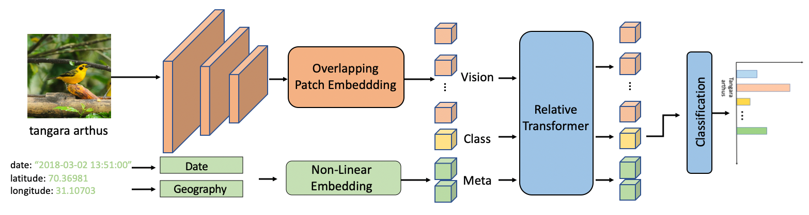
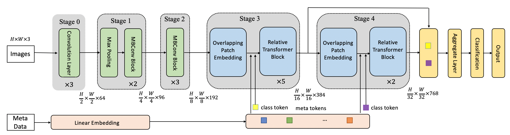

[](https://paperswithcode.com/sota/fine-grained-image-classification-on-cub-200?p=metaformer-a-unified-meta-framework-for-fine)
[](https://paperswithcode.com/sota/fine-grained-image-classification-on-nabirds?p=metaformer-a-unified-meta-framework-for-fine)
[](https://paperswithcode.com/sota/image-classification-on-inaturalist?p=metaformer-a-unified-meta-framework-for-fine)
[](https://paperswithcode.com/sota/image-classification-on-inaturalist-2018?p=metaformer-a-unified-meta-framework-for-fine)
# MetaFormer
A repository for the code used to create and train the model defined in “MetaFormer: A Unified Meta Framework for Fine-Grained Recognition” [arxiv:2203.02751](http://arxiv.org/abs/2203.02751)

Moreover, MetaFormer is similar to CoAtNet. Therefore, this repo can also be seen as a reference PyTorch implementation of “CoAtNet: Marrying Convolution and Attention for All Data Sizes” [arxiv:2106.04803](https://arxiv.org/abs/2106.04803)

## Model zoo
| name       | resolution   | 1k model   |  21k model   | iNat21 model   |
| :--------: | :----------: | :--------: | :----------: | :------------: |
| MetaFormer-0   | 224x224 | [metafg_0_1k_224](https://drive.google.com/file/d/1BYbe3mrKioN-Ara6hhJiaiEgJLl_thSH/view?usp=sharing)|[metafg_0_21k_224](https://drive.google.com/file/d/1834jQ9OPHOBZDgv7jD6Qu5mNLsD9aeZv/view?usp=sharing)|-|
| MetaFormer-1   | 224x224 | [metafg_1_1k_224](https://drive.google.com/file/d/1p-nIZgnrDatqmSzzDknTFYw-yEEUD_Rz/view?usp=sharing)|[metafg_1_21k_224](https://drive.google.com/file/d/1AcybDVEY-kXFT0D79w1G7I0h4r1IxLlG/view?usp=sharing)|-|
| MetaFormer-2   | 224x224 | [metafg_2_1k_224](https://drive.google.com/file/d/1K6EEyFKbMUBpPqaEJMvo93YHTXCsgH2V/view?usp=sharing)|[metafg_2_21k_224](https://drive.google.com/file/d/1VygaD_IwYq25KwoupWfttKRZUm2_SPeK/view?usp=sharing)|-|
| MetaFormer-0   |     384x384      |  [metafg_0_1k_384](https://drive.google.com/file/d/1r62S3CJFRWV_qA5udC9MOFOJYwRf8mE2/view?usp=sharing)  |  [metafg_0_21k_384](https://drive.google.com/file/d/1wVmlPjNTA6JKHcF3ROGorEVPxKVO83Ss/view?usp=sharing)  |  [metafg_0_inat21_384](https://drive.google.com/file/d/11gCk_IuSN7krdkOUSWSM4xlf8GGknmxc/view?usp=sharing)  |
| MetaFormer-1   |     384x384      |  [metafg_1_1k_384](https://drive.google.com/file/d/12OTmZg4J6fMGvs-colOTDfmhdA5EMMvo/view?usp=sharing)  |  [metafg_1_21k_384](https://drive.google.com/file/d/13dsarbtsNrkhpG5XpCRlN5ogXDGXO3Z_/view?usp=sharing)  |  [metafg_1_inat21_384](https://drive.google.com/file/d/1ATUIrDxaQaGqx4lJ8HE2IwX_evMhblPu/view?usp=sharing)  |
| MetaFormer-2   |     384x384      |  [metafg_2_1k_384](https://drive.google.com/file/d/167oBaseORq32aFA3Ex6lpHuasvu2PMb8/view?usp=sharing)  |  [metafg_2_21k_384](https://drive.google.com/file/d/1PnpntloQaYduEokFGQ6y79G7DdyjD_u3/view?usp=sharing)  |  [metafg_2_inat21_384](https://drive.google.com/file/d/17sUNST7ivQhonBAfZEiTOLAgtaHa4F3e/view?usp=sharing)  |

You can also get model by https://pan.baidu.com/s/1ZGEDoWWU7Z0vx0VCjEbe6g (password:3uiq).
## Usage
#### python module
* install `Pytorch and torchvision`
```
pip install torch==1.5.1 torchvision==0.6.1
```
* install `timm`
```
pip install timm==0.4.5
```
* install `Apex`
```
git clone https://github.com/NVIDIA/apex
cd apex
pip install -v --disable-pip-version-check --no-cache-dir --global-option="--cpp_ext" --global-option="--cuda_ext" ./
```
* install other requirements
```
pip install opencv-python==4.5.1.48 yacs==0.1.8
```
#### data preparation
Download [inat21,18,17](https://github.com/visipedia/inat_comp),[CUB](http://www.vision.caltech.edu/visipedia/CUB-200-2011.html),[NABirds](https://dl.allaboutbirds.org/nabirds),[stanfordcars](https://ai.stanford.edu/~jkrause/cars/car_dataset.html), and [aircraft](https://www.robots.ox.ac.uk/~vgg/data/fgvc-aircraft/), put them in respective folders (\<root\>/datasets/<dataset_name>) and Unzip file. The folder sturture as follow:
```
datasets
  |————inraturelist2021
  |       └——————train
  |       └——————val
  |       └——————train.json
  |       └——————val.json
  |————inraturelist2018
  |       └——————train_val_images
  |       └——————train2018.json
  |       └——————val2018.json
  |       └——————train2018_locations.json
  |       └——————val2018_locations.json
  |       └——————categories.json.json
  |————inraturelist2017
  |       └——————train_val_images
  |       └——————train2017.json
  |       └——————val2017.json
  |       └——————train2017_locations.json
  |       └——————val2017_locations.json
  |————cub-200
  |       └——————...
  |————nabirds
  |       └——————...
  |————stanfordcars
  |       └——————car_ims
  |       └——————cars_annos.mat
  |————aircraft
  |       └——————...
```
#### Training
You can dowmload pre-trained model from model zoo, and put them under \<root\>/pretrained.
To train MetaFG on datasets, run:
```
python3 -m torch.distributed.launch --nproc_per_node <num-of-gpus-to-use> --master_port 12345  main.py --cfg <config-file> --dataset <dataset-name> --pretrain <pretainedmodel-path> [--batch-size <batch-size-per-gpu> --output <output-directory> --tag <job-tag>]
```
\<dataset-name\>:inaturelist2021,inaturelist2018,inaturelist2017,cub-200,nabirds,stanfordcars,aircraft
For CUB-200-2011, run:
```
python3 -m torch.distributed.launch --nproc_per_node 8 --master_port 12345  main.py --cfg ./configs/MetaFG_1_224.yaml --batch-size 32 --tag cub-200_v1 --lr 5e-5 --min-lr 5e-7 --warmup-lr 5e-8 --epochs 300 --warmup-epochs 20 --dataset cub-200 --pretrain ./pretrained_model/<xxxx>.pth --accumulation-steps 2 --opts DATA.IMG_SIZE 384  
```
note that final learning rate is total_bs/512.
#### Eval
To evaluate model on dataset,run:
```
python3 -m torch.distributed.launch --nproc_per_node <num-of-gpus-to-use> --master_port 12345  main.py --eval --cfg <config-file> --dataset <dataset-name> --resume <checkpoint> [--batch-size <batch-size-per-gpu>]
```
## Main Result
#### ImageNet-1k 
| Name       | Resolution   | #Param   |  #FLOPS   | Throughput   | Top-1 acc |
| :--------: | :----------: | :--------: | :----------: | :------------: | :------------: |
| MetaFormer-0   |     224x224      |  28M  |  4.6G  |  840.1  | 82.9 |
| MetaFormer-1   |     224x224      |  45M  |  8.5G  |  444.8  | 83.9 |
| MetaFormer-2   |     224x224      |  81M  |  16.9G  |  438.9  | 84.1 |
| MetaFormer-0   |     384x384      |  28M  |  13.4G  |  349.4  | 84.2 |
| MetaFormer-1   |     384x384      |  45M  |  24.7G  |  165.3  | 84.4 |
| MetaFormer-2   |     384x384      |  81M  |  49.7G  |  132.7  | 84.6 |
#### Fine-grained Datasets
Result on fine-grained datasets with different pre-trained model.
| Name       | Pretrain   | CUB | NABirds |  iNat2017   | iNat2018  | Cars | Aircraft |
| :--------: | :----------: | :--------: | :----------: | :------------: | :------------: | :--------: |:--------: |
| MetaFormer-0|ImageNet-1k|89.6|89.1|75.7|79.5|95.0|91.2|
| MetaFormer-0|ImageNet-21k|89.7|89.5|75.8|79.9|94.6|91.2|
| MetaFormer-0|iNaturalist 2021|91.8|91.5|78.3|82.9|95.1|87.4|
| MetaFormer-1|ImageNet-1k|89.7|89.4|78.2|81.9|94.9|90.8|
| MetaFormer-1|ImageNet-21k|91.3|91.6|79.4|83.2|95.0|92.6|
| MetaFormer-1|iNaturalist 2021|92.3|92.7|82.0|87.5|95.0|92.5|
| MetaFormer-2|ImageNet-1k|89.7|89.7|79.0|82.6|95.0|92.4|
| MetaFormer-2|ImageNet-21k|91.8|92.2|80.4|84.3|95.1|92.9|
| MetaFormer-2|iNaturalist 2021|92.9|93.0|82.8|87.7|95.4|92.8|


Results in iNaturalist 2019, iNaturalist 2018, and iNaturalist 2021 with meta-information.
| Name       | Pretrain   | Meta added| iNat2017   |  iNat2018   | iNat2021   |
| :--------: | :----------: | :--------: | :---------- | :------------ |:------------ |
|MetaFormer-0|ImageNet-1k|N|75.7|79.5|88.4|
|MetaFormer-0|ImageNet-1k|Y|79.8(+4.1)|85.4(+5.9)|92.6(+4.2)|
|MetaFormer-1|ImageNet-1k|N|78.2|81.9|90.2|
|MetaFormer-1|ImageNet-1k|Y|81.3(+3.1)|86.5(+4.6)|93.4(+3.2)|
|MetaFormer-2|ImageNet-1k|N|79.0|82.6|89.8|
|MetaFormer-2|ImageNet-1k|Y|82.0(+3.0)|86.8(+4.2)|93.2(+3.4)|
|MetaFormer-2|ImageNet-21k|N|80.4|84.3|90.3|
|MetaFormer-2|ImageNet-21k|Y|83.4(+3.0)|88.7(+4.4)|93.6(+3.3)|
## Citation

```
@article{MetaFormer,
  title={MetaFormer: A Unified Meta Framework for Fine-Grained Recognition},
  author={Diao, Qishuai and Jiang, Yi and Wen, Bin and Sun, Jia and Yuan, Zehuan},
  journal={arXiv preprint arXiv:2203.02751},
  year={2022},
}
```

## Acknowledgement
Many thanks for [swin-transformer](https://github.com/microsoft/Swin-Transformer).A part of the code is borrowed from it.
